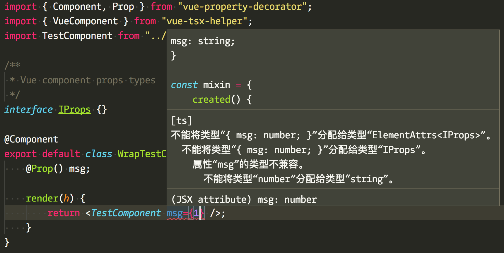
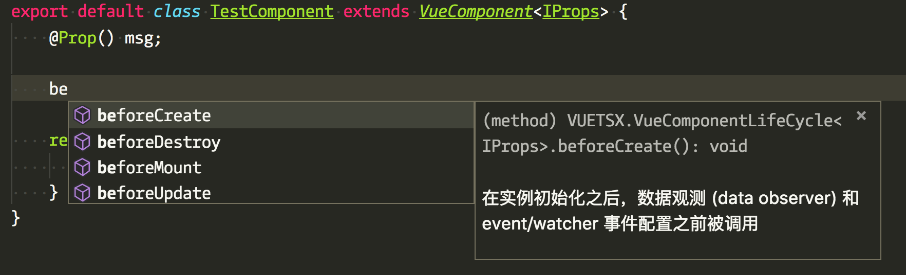

<div align="center">

## Vue-TSX-Helper

**Write class-based Vue component with TypeScript .**

[](https://github.com/thundernet8/Vue-TSX-Helper/issues)
[](https://github.com/thundernet8/Vue-TSX-Helper/network)
[](https://github.com/thundernet8/Vue-TSX-Helper/stargazers)
[](https://david-dm.org/thundernet8/Vue-TSX-Helper)
[](https://travis-ci.org/thundernet8/Vue-TSX-Helper)
[](https://github.com/thundernet8/Vue-TSX-Helper/blob/master/LICENSE)
[](https://github.com/prettier/prettier)

</div>

<br>

## Installation

```
npm install vue-tsx-helper
```

## Usage

A class-based Vue component sample

```typescript
// TestComponent.tsx

import { Component, Prop } from "vue-property-decorator";
import { VueComponent } from "vue-tsx-helper";

/**
 * Vue component props types
 */
interface IProps {
    msg: string;
}

const mixin = {
    created() {
        console.log("mixin created");
    }
};

@Component({
    name: "TestComponent",
    mixins: [mixin]
})
export default class TestComponent extends VueComponent<IProps> {
    @Prop() msg;

    created() {
        console.log("created");
    }

    render(h) {
        return <div class="container">{"parent message: " + this.msg}</div>;
    }
}
```

now import `TestComponent` in its parent

```typescript
// WrapTestComponent.tsx
import { Component, Prop } from "vue-property-decorator";
import { VueComponent } from "vue-tsx-helper";
import TestComponent from "./TestComponent";

/**
 * Vue component props types
 */
interface IProps {}

@Component
export default class WrapTestComponent extends VueComponent<IProps> {
    @Prop() msg;

    render(h) {
        return <TestComponent msg="msg from parent" />;
    }
}
```

For components supplied by other libraries, try:

```typescript
@Component
export default class WrapTestComponent extends VueComponent<{}> {
    @Prop() msg;

    render(h) {
        render <anyslot is="router-link" to="/">link</anyslot>
    }
}
```

## Screenshots




